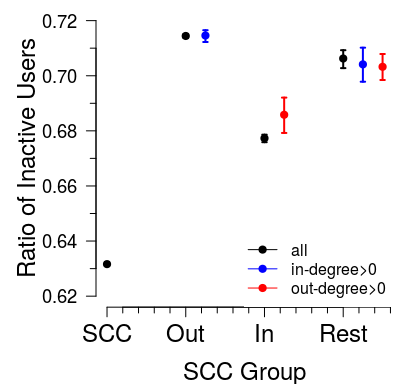

# Predicting inactivity in Twitter
David Garcia  
12.09.2016  
  

```r
download.file("https://www.sg.ethz.ch/media/medialibrary/2016/09/01_IPP_Inactivity.zip", destfile="01_IPP_Inactivity.zip")
unzip("01_IPP_Inactivity.zip", exdir = "./") 
file.remove("01_IPP_Inactivity.zip")

data <- read.table("InactiveDataTrain.dat", header=T, sep="\t", 
                    colClasses=c(rep("integer", 1), "character", rep("integer", 2)))

data$included <- data$lastts > 1248998400
data$inactive <- data$lastts < 1459468800 #April 1st, 2016 (<3 months active) 
```


```r
width <- 7*24*60*60
ds <- seq(min(data$lastts), max(data$lastts)+width, by=width) 
histogram <- hist(data$lastts, breaks=ds, plot=F)

dates <- as.Date(as.POSIXct(histogram$mids, origin="1970-01-01"))
par(mar=c(4,4,0.5,0))
plot(dates, histogram$counts, type="l", lwd=2, ylab="Amount of users", xlab="Date of last tweet", cex.lab=1.5, cex.axis=1.5)

retrieval <- as.Date(as.POSIXct(1248998400, origin="1970-01-01")) #July 31st, 2009
actived <- as.Date(as.POSIXct(1459468800, origin="1970-01-01")) #April 1st, 2016

lastd <- as.Date(as.POSIXct(14594688000, origin="1970-01-01"))
firstd <- as.Date(as.POSIXct(00, origin="1970-01-01"))

polygon( c(actived, actived, lastd,lastd), c(-10^6,10*max(histogram$counts),10*max(histogram$counts),-10^6), border="white", col=rgb(0,0,1,0.25))
abline(v=actived, col="blue", lwd=2.5, lty=2)
text(x=actived-90, y=1000000, "Activity threshold", col="blue", srt=90, cex=1.1)

polygon( c(firstd, firstd, retrieval,retrieval), c(-10^6,10*max(histogram$counts),10*max(histogram$counts),-10^6), border="white", col=rgb(1,0,0,0.25))
abline(v=retrieval, col="red", lty=2, lwd=2.5)
text(x=retrieval+90, y=930000, "Date of network retrieval", col="red", srt=90, cex=0.9)
lines(dates, histogram$counts, lwd=2)
```

<!-- -->


```r
print(paste("N:",sum(data$included)))
```

```
## [1] "N: 15792514"
```

```r
print(paste("Active: ",sum(!data$inactive)))
```

```
## [1] "Active:  5621146"
```

```r
print(paste("%: ",sum(!data$inactive)/sum(data$included)))
```

```
## [1] "%:  0.355937376405049"
```


```r
R <- 1000
inactIncoreDF <- activeRatioDF(data$inactive, data$incore, data$included, R, by=0.1)
save(inactIncoreDF, file="incoreP-full-2.RData")

inactIncoreDF <- activeRatioDF(data$inactive, data$followers, data$included, R, by=0.1)
save(inactIncoreDF, file="followersP-2.RData")
```


```r
par(mar=c(4,5,0.5,0.5))
load("incoreP-full-2.RData")
f <- inactIncoreDF$i>0 & !is.na(inactIncoreDF$pinmn)
ylim <- range(0,0.75)
xlim <- c(1,2000000)
plot(inactIncoreDF$i[f], inactIncoreDF$pinmn[f], log="x", type="l", ylim=ylim, xlim=xlim, col="red", ylab="Ratio of inactive users", xlab="Reputation, Popularity", cex.axis=1.5, cex.lab=1.5, xaxt="n", yaxt="n")
polygon(c(inactIncoreDF$i[f],rev(inactIncoreDF$i[f])), c(inactIncoreDF$pinlow[f], rev(inactIncoreDF$pinhigh[f])), col=rgb(1,0,0,0.25), border="red")
lines(inactIncoreDF$i[f], inactIncoreDF$pinmn[f], col="red")

load("followersP-2.RData")
f <- inactIncoreDF$i>0 & !is.na(inactIncoreDF$pinmn)
lines(inactIncoreDF$i[f], inactIncoreDF$pinmn[f], log="x", type="l", ylim=ylim, xlim=xlim, col="blue", cex.axis=1.5, cex.lab=1.5)
```

```
## Warning in plot.xy(xy.coords(x, y), type = type, ...): "log" is not a
## graphical parameter
```

```r
polygon(c(inactIncoreDF$i[f],rev(inactIncoreDF$i[f])), c(inactIncoreDF$pinlow[f], rev(inactIncoreDF$pinhigh[f])), col=rgb(0,0,1,0.25), border="blue")
lines(inactIncoreDF$i[f], inactIncoreDF$pinmn[f], col="blue")
legend("bottomleft", c("Reputation", "Popularity"), col=c("red", "blue"), lwd=c(2,2), box.lwd=-1, cex=1.25)

library(sfsmisc)
eaxis(1,cex.axis=1.5)
eaxis(2,cex.axis=1.5)
```

<!-- -->


```r
par(mar=c(4,5,0.5,0.75))

inCont <- data$included & data$group=="I"
outCont <- data$included & data$group=="O"
tendrils <- data$included & data$group=="T"
scc <- data$included & data$group=="S"

prop.test(x=c(sum(data$inactive[inCont]), sum(data$inactive[scc])), n=c(sum(inCont), sum(scc)))
```

```
## 
## 	2-sample test for equality of proportions with continuity
## 	correction
## 
## data:  c(sum(data$inactive[inCont]), sum(data$inactive[scc])) out of c(sum(inCont), sum(scc))
## X-squared = 3887.1, df = 1, p-value < 2.2e-16
## alternative hypothesis: two.sided
## 95 percent confidence interval:
##  0.04437171 0.04716814
## sample estimates:
##    prop 1    prop 2 
## 0.6773958 0.6316258
```

```r
prop.test(x=c(sum(data$inactive[outCont]), sum(data$inactive[scc])), n=c(sum(outCont), sum(scc)))
```

```
## 
## 	2-sample test for equality of proportions with continuity
## 	correction
## 
## data:  c(sum(data$inactive[outCont]), sum(data$inactive[scc])) out of c(sum(outCont), sum(scc))
## X-squared = 53705, df = 1, p-value < 2.2e-16
## alternative hypothesis: two.sided
## 95 percent confidence interval:
##  0.08216316 0.08349700
## sample estimates:
##    prop 1    prop 2 
## 0.7144559 0.6316258
```

```r
prop.test(x=c(sum(data$inactive[tendrils]), sum(data$inactive[scc])), n=c(sum(tendrils), sum(scc)))
```

```
## 
## 	2-sample test for equality of proportions with continuity
## 	correction
## 
## data:  c(sum(data$inactive[tendrils]), sum(data$inactive[scc])) out of c(sum(tendrils), sum(scc))
## X-squared = 1193.8, df = 1, p-value < 2.2e-16
## alternative hypothesis: two.sided
## 95 percent confidence interval:
##  0.07066803 0.07868982
## sample estimates:
##    prop 1    prop 2 
## 0.7063048 0.6316258
```

```r
bootstrapRatio <- function(x, R=100, L=length(x))
{
  ps <- NULL
  for (i in seq(1,R))
  {
    rx <- sample(x, size=L, replace=TRUE)
    ps <- c(ps, sum(rx)/L)
  }
  return(sort(ps))
}

nrep<-1000
inPs <- bootstrapRatio(data$inactive[inCont], R=nrep)
outPs <- bootstrapRatio(data$inactive[outCont], R=nrep)
tenPs <- bootstrapRatio(data$inactive[tendrils], R=nrep)
sccPs <- bootstrapRatio(data$inactive[scc], R=nrep)

mns <- c(mean(sccPs), mean(outPs), mean(inPs), mean(tenPs))
los <- c(sccPs[round(nrep*0.025)], mean(outPs[round(nrep*0.025)]), mean(inPs[round(nrep*0.025)]), mean(tenPs[round(nrep*0.025)]))
his <- c(mean(sccPs[round(nrep*0.975)]), mean(outPs[round(nrep*0.975)]), mean(inPs[round(nrep*0.975)]), mean(tenPs[round(nrep*0.975)]))

library(Hmisc)
errbar(seq(1,4), mns, los, his, lwd=2, pch=19, cex=1, xlab="SCC Group", ylab="Ratio of Inactive Users", axes=F, ylim=c(0.62,0.72), cex.lab=1.5)
eaxis(1, at=c(1,2,3,4), labels=c("SCC", "Out", "In", "Rest"), cex.axis=1.5)
eaxis(2, cex.axis=1.15)
```

<!-- -->


```r
library(arm)
library(texreg)

seldata1 <- data.frame(inactive=data$inactive[data$included], incore=data$incore[data$included], followers=data$followers[data$included])

mI4 <- bayesglm(inactive ~ poly(log(incore+1),4), data=seldata, family="binomial")
save(mI4, file="mI4-orth.RData")
mF4 <- bayesglm(inactive ~ poly(log(followers+1),4), data=seldata, family="binomial")
save(mF4, file="mF4-orth.RData")

mI4 <- bayesglm(inactive ~ poly(log(incore+1),4, raw=TRUE), data=seldata, family="binomial")
save(mI4, file="mI4.RData")
mF4 <- bayesglm(inactive ~ poly(log(followers+1),4, raw=TRUE), data=seldata, family="binomial")
save(mF4, file="mF4.RData")
```


```r
rm(list=ls())
library(arm)
library(texreg)
load("mI4.RData")
load("mF4.RData")
screenreg(list(mI4,mF4), digits=4, file="modelTable1.txt")
```


```r
cat(readChar("modelTable1.txt", 1e5))
```

```
## 
## ========================================================================
##                                   Model 1             Model 2           
## ------------------------------------------------------------------------
## (Intercept)                               0.6172 ***          0.5915 ***
##                                          (0.0028)            (0.0026)   
## poly(incoreL, 4, raw = TRUE)1             0.7429 ***                    
##                                          (0.0052)                       
## poly(incoreL, 4, raw = TRUE)2            -0.4607 ***                    
##                                          (0.0033)                       
## poly(incoreL, 4, raw = TRUE)3             0.0604 ***                    
##                                          (0.0008)                       
## poly(incoreL, 4, raw = TRUE)4            -0.0016 ***                    
##                                          (0.0001)                       
## poly(followersL, 4, raw = TRUE)1                              0.6698 ***
##                                                              (0.0037)   
## poly(followersL, 4, raw = TRUE)2                             -0.3717 ***
##                                                              (0.0018)   
## poly(followersL, 4, raw = TRUE)3                              0.0496 ***
##                                                              (0.0003)   
## poly(followersL, 4, raw = TRUE)4                             -0.0020 ***
##                                                              (0.0000)   
## ------------------------------------------------------------------------
## AIC                                20021517.4055       20040393.5115    
## BIC                                20021590.2807       20040466.3867    
## Log Likelihood                    -10010753.7027      -10020191.7558    
## Deviance                           20021507.4055       20040383.5115    
## Num. obs.                          15792514            15792514         
## ========================================================================
## *** p < 0.001, ** p < 0.01, * p < 0.05
```


```r
rm(list=ls())
library(arm)
library(texreg)
load("mI4-orth.RData")
load("mF4-orth.RData")
screenreg(list(mI4,mF4), digits=4, file="modelTable2.txt")
```


```r
cat(readChar("modelTable2.txt", 1e5))
```

```
## 
## ============================================================
##                       Model 1             Model 2           
## ------------------------------------------------------------
## (Intercept)                   0.6073 ***          0.6070 ***
##                              (0.0005)            (0.0005)   
## poly(incoreL, 4)1         -1347.0793 ***                    
##                              (2.0969)                       
## poly(incoreL, 4)2          -186.1654 ***                    
##                              (2.0883)                       
## poly(incoreL, 4)3           666.0353 ***                    
##                              (2.0772)                       
## poly(incoreL, 4)4           -53.0135 ***                    
##                              (2.1024)                       
## poly(followersL, 4)1                          -1352.4721 ***
##                                                  (2.1005)   
## poly(followersL, 4)2                           -265.9020 ***
##                                                  (2.1125)   
## poly(followersL, 4)3                            501.4198 ***
##                                                  (2.2279)   
## poly(followersL, 4)4                           -259.8916 ***
##                                                  (2.4896)   
## ------------------------------------------------------------
## AIC                    20021517.4106       20040393.5114    
## BIC                    20021590.2858       20040466.3867    
## Log Likelihood        -10010753.7053      -10020191.7557    
## Deviance               20021507.4106       20040383.5114    
## Num. obs.              15792514            15792514         
## ============================================================
## *** p < 0.001, ** p < 0.01, * p < 0.05
```


```r
dataT <- read.table("InactiveDataTest.dat", header=T, sep="\t", 
                    colClasses=c("integer", "character", rep("integer", 2)))
dataT$included <- dataT$lastts > 1248998400
dataT$inactive <- dataT$lastts < 1459468800 #April 1st, 2016 (<3 months active) 

load("mI4.RData")
preds <- predict(mI4, data.frame(incoreL=log(dataT$incore[data$included]+1)), type="response")
truevals <- dataT$inactive[dataT$included]
rcI <- roc(response=truevals, predictor=preds, ci=TRUE)
save(rcI, file="mI4ROC.RData")

load("mF4.RData")
preds <- predict(mF4, data.frame(followersL=log(dataT$followers[data$included]+1)), type="response")
truevals <- dataT$inactive[dataT$included]
rcF <- roc(response=truevals, predictor=preds, ci=TRUE)
save(rcF, file="mF4ROC.RData")
```


```r
rm(list=ls())
library(arm)
library(pROC)
load("mI4ROC.RData") 
load("mF4ROC.RData") 

sink("rocTest.txt")
roc.test(rcI, rcF)
```


```r
rm(list=ls()) 
cat(readChar("rocTest.txt", 1e5))
```

```
##  DeLong's test for two correlated ROC curves
## 
## data:  rcI and rcF
## Z = 20.958, p-value < 2.2e-16
## alternative hypothesis: true difference in AUC is not equal to 0
## sample estimates:
## AUC of roc1 AUC of roc2 
##   0.5931735   0.5905627
```


```r
load("mF4.RData")
xs <- 10^seq(0,log10(max(data$followers[data$included])), by=0.01)
preds <- predict(mF4, data.frame(followersL=log(xs+1)), se.fit=TRUE, type="response")
preds$xs <- xs
save(preds, file="mF4preds.RData")

load("mI4.RData")
xs <- 10^seq(0,log10(max(data$incore[data$included])), by=0.1)
preds <- predict(mI4, data.frame(incoreL=log(xs+1)), se.fit=TRUE, type="response")
preds$xs <- xs
save(preds, file="mI4preds.RData")
```


```r
par(mar=c(4,5,0.5,0.5))
load("mF4preds.RData")
ylim <- c(0,0.75)
xlim <- c(1,2000000)
plot(preds$xs, preds$fit,  log="x", ylim=ylim, col="blue", type="l", xlab="Reputation, Popularity", ylab="Probability of inactivity", xaxt="n", yaxt="n", cex.lab=1.5, xlim=xlim) 
polygon(c(preds$xs, rev(preds$xs)), c(preds$fit-2*preds$se.fit, rev(preds$fit+2*preds$se.fit)), col=rgb(0,0,1,0.25), border="blue")
lines(preds$xs, preds$fit,lwd=2, col="blue") 

load("mI4preds.RData")
polygon(c(preds$xs, rev(preds$xs)), c(preds$fit-2*preds$se.fit, rev(preds$fit+2*preds$se.fit)), col=rgb(1,0,0,0.25), border="red")
lines(preds$xs, preds$fit,lwd=2, col="red") 

legend("bottomleft", c("Reputation", "Popularity"), col=c("red", "blue"), lwd=c(2,2), box.lwd=-1, cex=1.25)

library(sfsmisc)
eaxis(1,cex.axis=1.5)
eaxis(2,cex.axis=1.5)
```

<!-- -->


```r
load("mF4.RData")
load("mI4.RData")
load("mB4.RData")

datapreds <- data.frame(followers=dataT$followers[dataT$included], incore=dataT$incore[dataT$included], inactive=dataT$inactive[dataT$included])
dfp <- data.frame(followersL = log(datapreds$followers+1), incoreL=log(datapreds$incore+1))

predF4 <- predict(mF4, dfp, type="response")
predI4 <- predict(mI4, dfp, type="response")
predB4 <- predict(mB4, dfp, type="response")

datapreds <- cbind(datapreds, predF4, predI4, predB4)
save(datapreds, file="datapreds.RData")
```


```r
par(mar=c(4,5,0.5,0.5))
load("datapreds.RData")
res <- datapreds$inactive - datapreds$predF4
xs <- c(seq(0,max(log(datapreds$incore))/2, by=0.1), seq(max(log(datapreds$incore))/2 + 0.05, max(log(datapreds$incore)), by=0.3))

residualDF <- data.frame()
for (i in seq(1:(length(xs)-1)))
{
  f <- log(datapreds$incore) >= xs[i] & log(datapreds$incore) < xs[i+1]
  mn <- mean(res[f])
  se <- sd(res[f])/sqrt(sum(f))
  if (sum(f)>10)
    residualDF <- rbind(residualDF, data.frame(x=xs[i], midx = (xs[i]+xs[i+1])/2, mn,se,N=sum(f)))
  }

res <- datapreds$inactive - datapreds$predI4
xs <- c(seq(0,max(log(datapreds$followers))/2, by=0.1), seq(max(log(datapreds$followers))/2 + 0.05, max(log(datapreds$followers)), by=0.5))

residualDFF <- data.frame()
for (i in seq(1:(length(xs)-1)))
{
  f <- log(datapreds$followers) >= xs[i] & log(datapreds$followers) < xs[i+1]
  mn <- mean(res[f])
  se <- sd(res[f])/sqrt(sum(f))
  if (sum(f)>10)
    residualDFF <- rbind(residualDFF, data.frame(x=xs[i], midx = (xs[i]+xs[i+1])/2, mn,se,N=sum(f)))
}
plot(exp(residualDF$midx), residualDF$mn, ylim =c(-0.39,0.17), col="red", type="l", xlim=c(1,exp(11.5)), log="x", xlab="Reputation, Popularity", ylab="Residual probability of inactivity", xaxt="n", yaxt="n", cex.lab=1.35)
polygon(c(exp(residualDF$midx), rev(exp(residualDF$midx))), c(residualDF$mn-residualDF$se,rev(residualDF$mn+residualDF$se)), col=rgb(1,0,0,0.25), border="red")
lines(exp(residualDF$midx), residualDF$mn, col="red")

polygon(c(exp(residualDFF$midx), rev(exp(residualDFF$midx))), c(residualDFF$mn-residualDFF$se,rev(residualDFF$mn+residualDFF$se)), col=rgb(0,0,1,0.25), border="blue")
lines(exp(residualDFF$midx), residualDFF$mn, col="blue", type="l")
legend("bottomleft", c("Reputation", "Popularity"), col=c("red", "blue"), lwd=c(2,2), box.lwd=-1)

library(sfsmisc)
eaxis(1,cex.axis=1.5)
eaxis(2,cex.axis=1.2)
```

<!-- -->
