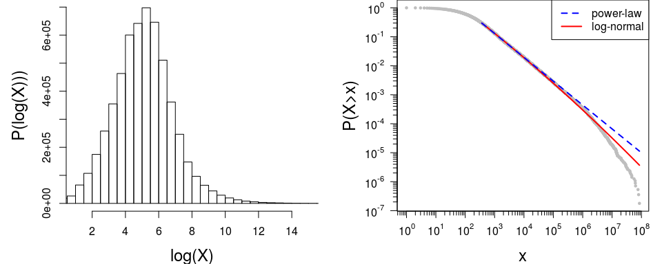
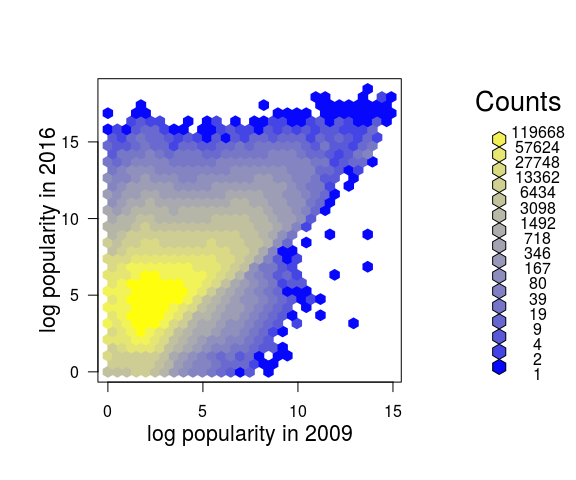
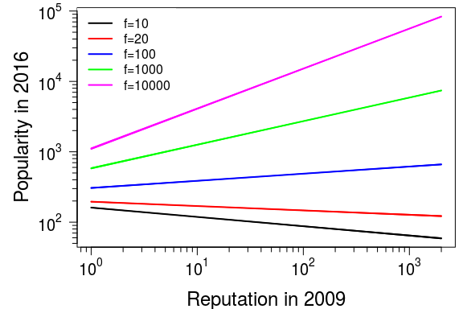
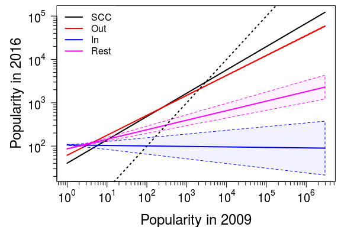
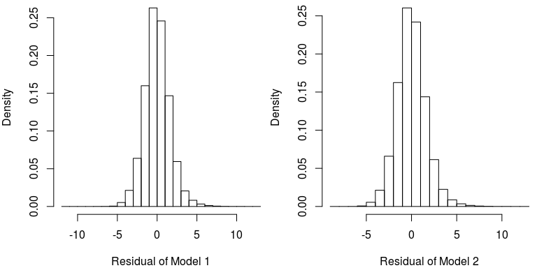

# Predicting popularity in Twitter
David Garcia  
18.08.2016  
  


```r
library(poweRlaw)
x<- data$followers2[data$followers2>0]

mpl <- displ$new(x)
mplXmin <- estimate_xmin(mpl)
mpl$setXmin(mplXmin)
estpl <- estimate_pars(mpl)
mpl$setPars(estpl)
save(mpl, file="mplFull.RData")

mlnorm <- dislnorm$new(x)
mlnorm$setXmin(mplXmin)
estlnorm <- estimate_pars(mlnorm)
mlnorm$setPars(estlnorm)
save(mlnorm, file="mlnorm.RData")
```


```r
library(poweRlaw)
library(sfsmisc)

par(mar=c(4,5,0,1))
par(mfrow=c(1,2))
hist(log(data$followers2[data$followers2>0]), breaks=50, main="", ylab="P(log(X)))", xlab="log(X)", xlim=c(1,15), cex.lab=1.5)

load("mplFull.RData")
load("mlnorm.RData") 

plot(mplFull, pch=19, cex=0.5, xlab="x", ylab = "P(X>x)", col="gray", cex.lab=1.5, xaxt="n", yaxt="n")
lines(mlnorm, col="red", lwd=2, lty=1)
lines(mplFull, col="blue", lwd=2, lty=2)

legend("topright", c("power-law", "log-normal"), col=c("blue", "red"), lwd=c(2,2), lty=c(2,1))

eaxis(1,cex.axis=1)
eaxis(2,cex.axis=1)
```

<!-- -->


```r
print(mplFull)
```

```
## Reference class object of class "displ"
```

```
## Field "xmin":
```

```
## [1] 367
```

```
## Field "pars":
```

```
## [1] 1.822832
```

```
## Field "no_pars":
```

```
## [1] 1
```

```r
print(mlnorm)
```

```
## Reference class object of class "dislnorm"
## Field "xmin":
```

```
## [1] 367
```

```
## Field "pars":
```

```
## [1] -36.06155   7.34065
```

```
## Field "no_pars":
```

```
## [1] 2
```

```r
dc <- compare_distributions(mplFull, mlnorm)
dc$test_statistic
```

```
## [1] -17.06798
```

```r
dc$p_two_sided
```

```
## [1] 2.569254e-65
```

```r
get_distance_statistic(mlnorm, distance = "reweight")
```

```
## [1] 0.09203951
```

```r
get_distance_statistic(mplFull, distance = "reweight")
```

```
## [1] 0.09999803
```


```r
y<- data$followers2[data$followers2>0 & data$followers>0]
x<- data$followers[data$followers2>0 & data$followers>0]
library(hexbin)
hb <- hexbin(log(x),log(y))
plot(hb,colramp=BTY, trans=log, inv=exp, xlab="log popularity in 2009", ylab="log popularity in 2016")
```

<!-- -->


```r
library(arm)
f <- data$followers2>0 & data$followers > 0 & data$incore > 0

seldata <- data.frame(f2=data$followers2[f], f1=data$followers[f], incore = data$incore[f], group= data$group[f])

mF <- bayesglm(log(f2)~log(f1), data=seldata)
save(mF, file="mF.RData")
mI <- bayesglm(log(f2)~log(incore), data=seldata)
save(mI, file="mI.RData")
mB <- bayesglm(log(f2)~log(f1)*log(incore), data=seldata)
save(mB, file="mB.RData")
mFC <- bayesglm(log(f2)~log(f1)*group, data=seldata)
save(mFC, file="mFC.RData")

nullM <- bayesglm(log(f2)~1, data=seldata)
save(nullM, file="nullM.RData")
```


```r
library(texreg)
library(arm)
load("mFC.RData")
load("mB.RData")
screenreg(list(mB, mFC), digits=4)
```

```
## 
## ===========================================================
##                      Model 1             Model 2           
## -----------------------------------------------------------
## (Intercept)                  4.4388 ***          4.6655 ***
##                             (0.0020)            (0.0325)   
## log(f1)                      0.2792 ***         -0.0113    
##                             (0.0026)            (0.0969)   
## log(incore)                 -0.3658 ***                    
##                             (0.0030)                       
## log(f1):log(incore)          0.1014 ***                    
##                             (0.0002)                       
## groupO                                          -0.5466 ***
##                                                 (0.0327)   
## groupS                                          -0.9688 ***
##                                                 (0.0325)   
## groupT                                          -0.2054 ***
##                                                 (0.0394)   
## log(f1):groupO                                   0.4717 ***
##                                                 (0.0969)   
## log(f1):groupS                                   0.5494 ***
##                                                 (0.0969)   
## log(f1):groupT                                   0.2314 *  
##                                                 (0.1060)   
## -----------------------------------------------------------
## AIC                   20546499.2805       20704821.5438    
## BIC                   20546566.8470       20704943.1634    
## Log Likelihood       -10273244.6403      -10352401.7719    
## Deviance              13760003.3123       14164685.4354    
## Num. obs.              5461777             5461777         
## ===========================================================
## *** p < 0.001, ** p < 0.01, * p < 0.05
```


```r
par(mar=c(4,5,0.5,0.5))
incore <- exp(seq(0, log(max(data$incore)), by=0.1))
f1 <- c(rep(10,length(incore)),rep(20,length(incore)),rep(100,length(incore)),rep(1000,length(incore)),rep(10000,length(incore)))

newdata <- data.frame(incore=rep(incore,5), f1)

preds <- predict(mB, newdata,se.fit =TRUE)

plot(incore, exp(preds$fit[f1==10]), type="l", log="xy", ylim=range(exp(preds$fit)), xlab="Reputation in 2009", ylab="Popularity in 2016", lwd=2, xaxt="n", yaxt="n", cex.lab=1.5)
polygon(c(incore, rev(incore)), c(exp(preds$fit[f1==10]+preds$se.fit[f1==10]), rev(exp(preds$fit[f1==10]-preds$se.fit[f1==10]))), col=rgb(0,0,0,0.25), border="black")

polygon(c(incore, rev(incore)), c(exp(preds$fit[f1==20]+preds$se.fit[f1==20]), rev(exp(preds$fit[f1==20]-preds$se.fit[f1==20]))), col=rgb(1,0,0,0.25), border="red")
lines(incore, exp(preds$fit[f1==20]), col="red", lwd=2)
polygon(c(incore, rev(incore)), c(exp(preds$fit[f1==100]+preds$se.fit[f1==100]), rev(exp(preds$fit[f1==100]-preds$se.fit[f1==100]))), col=rgb(0,0,1,0.25), border="blue")
lines(incore, exp(preds$fit[f1==100]), col="blue", lwd=2)
polygon(c(incore, rev(incore)), c(exp(preds$fit[f1==1000]+preds$se.fit[f1==1000]), rev(exp(preds$fit[f1==1000]-preds$se.fit[f1==1000]))), col=rgb(0,1,0,0.25), border="green")
lines(incore, exp(preds$fit[f1==1000]), col=rgb(0,1,0,1), lwd=2)
polygon(c(incore, rev(incore)), c(exp(preds$fit[f1==10000]+preds$se.fit[f1==10000]), rev(exp(preds$fit[f1==10000]-preds$se.fit[f1==10000]))), col=rgb(1,0,1,0.25), border=rgb(1,0,1))
lines(incore, exp(preds$fit[f1==10000]), col=rgb(1,0,1,1), lwd=2)

legend("topleft", c("f=10","f=20","f=100","f=1000","f=10000"), col=c("black", "red", "blue", "green", rgb(1,0,1)), lwd=rep(2,5), box.lwd=-1)

library(sfsmisc)
eaxis(1,cex.axis=1.25, at=10^c(0,1,2,3))
eaxis(2,cex.axis=1.25, at=10^c(2,3,4,5))
```

<!-- -->


```r
par(mar=c(4,5,0.5,0.5))

f1 <- exp(seq(0, log(max(data$followers)), by=0.1))
group <- c(rep("S",length(f1)),rep("I",length(f1)),rep("O",length(f1)),rep("T",length(f1)))
               
newdata <- data.frame(f1=rep(f1,4), group=group)
preds <- predict(mFC, newdata,se.fit =TRUE)

plot(f1, exp(preds$fit[group=="S"]), type="l", log="xy", ylim=range(c(exp(preds$fit+preds$se.fit),exp(preds$fit-preds$se.fit))), xlab="Popularity in 2009", ylab="Popularity in 2016", lwd=2, xaxt="n", yaxt="n", cex.lab=1.5)
polygon(c(f1, rev(f1)), c(exp(preds$fit[group=="S"]+preds$se.fit[group=="S"]), rev(exp(preds$fit[group=="S"]-preds$se.fit[group=="S"]))), col=rgb(0,0,0,0.25), border="black", lty=2)

polygon(c(f1, rev(f1)), c(exp(preds$fit[group=="O"]+preds$se.fit[group=="O"]), rev(exp(preds$fit[group=="O"]-preds$se.fit[group=="O"]))), col=rgb(1,0,0,0.25), border="red", lty=2)
lines(f1, exp(preds$fit[group=="O"]), col="red", lwd=2)
polygon(c(f1, rev(f1)), c(exp(preds$fit[group=="I"]+preds$se.fit[group=="I"]), rev(exp(preds$fit[group=="I"]-preds$se.fit[group=="I"]))), col=rgb(0,0,1,0.05), border="blue", lty=2)
lines(f1, exp(preds$fit[group=="I"]), col="blue", lwd=2)
polygon(c(f1, rev(f1)), c(exp(preds$fit[group=="T"]+preds$se.fit[group=="T"]), rev(exp(preds$fit[group=="T"]-preds$se.fit[group=="T"]))), col=rgb(1,0,1,0.05), border=rgb(1,0,1), lty=2)
lines(f1, exp(preds$fit[group=="T"]), col=rgb(1,0,1,1), lwd=2)

legend("topleft", c("SCC","Out","In","Rest"), col=c("black", "red", "blue", rgb(1,0,1)), lwd=rep(2,4), box.lwd=-1)
abline(0,1, lty=3, lwd=2)

library(sfsmisc)
eaxis(1,cex.axis=1.25, at=10^seq(0,6))
eaxis(2,cex.axis=1.25, at=10^seq(1,5))
```

<!-- -->


```r
par(mfrow=c(1,2))
par(mar=c(4,4,0,0))
hist(residuals(mB), main="", xlab="Residual of Model 1", probability=TRUE)
shapiro.test(sample(residuals(mB),5000))
```

```
## 
## 	Shapiro-Wilk normality test
## 
## data:  sample(residuals(mB), 5000)
## W = 0.98904, p-value < 2.2e-16
```

```r
ks.test(residuals(mB),pnorm)
```

```
## Warning in ks.test(residuals(mB), pnorm): ties should not be present for
## the Kolmogorov-Smirnov test
```

```
## 
## 	One-sample Kolmogorov-Smirnov test
## 
## data:  residuals(mB)
## D = 0.094371, p-value < 2.2e-16
## alternative hypothesis: two-sided
```

```r
hist(residuals(mFC), main="", xlab="Residual of Model 2", probability=TRUE)
```

<!-- -->

```r
shapiro.test(sample(residuals(mFC),5000))
```

```
## 
## 	Shapiro-Wilk normality test
## 
## data:  sample(residuals(mFC), 5000)
## W = 0.99289, p-value = 4.172e-15
```

```r
ks.test(residuals(mFC),pnorm)
```

```
## Warning in ks.test(residuals(mFC), pnorm): ties should not be present for
## the Kolmogorov-Smirnov test
```

```
## 
## 	One-sample Kolmogorov-Smirnov test
## 
## data:  residuals(mFC)
## D = 0.099399, p-value < 2.2e-16
## alternative hypothesis: two-sided
```


```r
rm(list=ls())
library(arm)
library(dplyr)
testdata <- read.table("PopularityDataTest.dat", header=T, sep="\t", 
                    colClasses=c("integer", "character", rep("integer", 2)))

testdata %>% filter(followers2>0 & followers > 0 & incore > 0) -> testdata
seldatatest <- data.frame(f2=testdata$followers2, f1=testdata$followers, incore = testdata$incore, group=testdata$group)

load("nullM.RData")
mean(abs(nullM$fitted.values-nullM$y))
```

```
## [1] 1.372127
```

```r
mean(abs(predict(nullM, seldatatest)-log(seldatatest$f2)))
```

```
## [1] 1.370178
```

```r
load("mF.RData")
mean(abs(mF$fitted.values-mF$y))
```

```
## [1] 1.24229
```

```r
mean(abs(predict(mF, seldatatest)-log(seldatatest$f2)))
```

```
## [1] 1.24231
```

```r
load("mI.RData")
mean(abs(mI$fitted.values-mI$y))
```

```
## [1] 1.245963
```

```r
mean(abs(predict(mI, seldatatest)-log(seldatatest$f2)))
```

```
## [1] 1.246136
```

```r
load("mB.RData")
mean(abs(mB$fitted.values-mB$y))
```

```
## [1] 1.22034
```

```r
mean(abs(predict(mB, seldatatest)-log(seldatatest$f2)))
```

```
## [1] 1.220285
```

```r
load("mFC.RData")
mean(abs(mFC$fitted.values-mFC$y))
```

```
## [1] 1.239323
```

```r
mean(abs(predict(mFC, seldatatest)-log(seldatatest$f2)))
```

```
## [1] 1.239349
```
 
Null train:  1.372127 test: 1.370178
mF train: 1.24229 test: 1.24231
mI train: 1.245963 test: 1.246136
mB train: 1.220341.22034  test: 1.220285
mC train: 1.368907 test: 1.3671
mFC train: 1.239323  test: 1.239349

