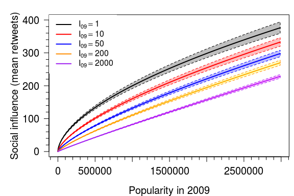
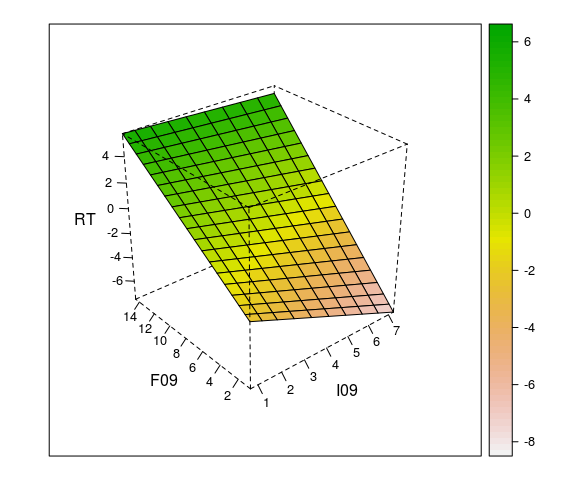

# Social Impact in Twitter
David Garcia  
22.05.2017  


```r
download.file("https://www.sg.ethz.ch/media/medialibrary/2017/05/03_IPP_SocialInfluence.zip", destfile="03_Social_Influence.zip")
unzip("03_Social_Influence.zip", exdir = "./") 
file.remove("03_Social_Influence.zip")
```


```r
library(arm)
library(texreg)
library(lmtest)

d <- read.table("RTdata-train.dat", header=T, sep="\t")

ds <- data.frame(logRT=log(d$avgRT), logFollowers = log(d$followers+1), logIncore = log(d$incore+1), c=relevel(as.factor(d$continent), ref="T"))

m1 <- bayesglm(logRT ~ logFollowers, data=ds)                                       
m2 <- bayesglm(logRT ~ logIncore, data=ds)     
m3 <- bayesglm(logRT ~ logIncore*logFollowers, data=ds) 

screenreg(list(m1,m2,m3), digits=4)
```


===============================================================================
                        Model 1            Model 2            Model 3          
-------------------------------------------------------------------------------
(Intercept)                   -2.6420 ***        -2.5921 ***        -2.1160 ***
                              (0.0019)           (0.0020)           (0.0033)   
logFollowers                   0.1532 ***                            0.5430 ***
                              (0.0006)                              (0.0033)   
logIncore                                         0.1563 ***        -0.8395 ***
                                                 (0.0007)           (0.0039)   
logIncore:logFollowers                                               0.0515 ***
                                                                    (0.0003)   
-------------------------------------------------------------------------------
AIC                     12384948.3227      12402879.1673      12324353.9407    
BIC                     12384987.3510      12402918.1956      12324418.9880    
Log Likelihood          -6192471.1613      -6201436.5836      -6162171.9704    
Deviance                 8240167.6257       8285062.5597       8090235.0982    
Num. obs.                3300045            3300045            3300045         
===============================================================================
*** p < 0.001, ** p < 0.01, * p < 0.05


```r
lrtest(m1,m2)
```

```
## Likelihood ratio test
## 
## Model 1: logRT ~ logFollowers
## Model 2: logRT ~ logIncore
##   #Df   LogLik Df Chisq Pr(>Chisq)    
## 1   3 -6192471                        
## 2   3 -6201437  0 17931  < 2.2e-16 ***
## ---
## Signif. codes:  0 '***' 0.001 '**' 0.01 '*' 0.05 '.' 0.1 ' ' 1
```

```r
par(mar=c(4,4,0,0))
hist(ds$logRT, main="", xlab="log mean RT",breaks=70)
```

<!-- -->


```r
par(mar=c(4,6,0,0))
mRT <- m3
hist(residuals(mRT), main="", xlab="Residuals of RT Model", ylab="density", cex.axis=2, cex.lab=2)
```

<!-- -->

```r
shapiro.test(sample(residuals(mRT),5000))
```

```
## 
## 	Shapiro-Wilk normality test
## 
## data:  sample(residuals(mRT), 5000)
## W = 0.98998, p-value < 2.2e-16
```


```r
par(mar=c(4,5,1.5,0.5))

incorevals <- log(c(1,10,50,200,2000)+1)
follvals <- seq(0, log(max(d$followers)), by=0.01)

RTpred <- predict(mRT, data.frame(logFollowers=follvals, logIncore=rep(incorevals[1], length(follvals))), se.fit=TRUE)
plot(exp(follvals), exp(RTpred$fit), type="l", lwd=2, xlab="Popularity in 2009", ylab="Social influence (mean retweets)", xaxt="n", yaxt="n", cex.lab=1.25, ylim=c(0,400))
polygon(c(exp(follvals), rev(exp(follvals))), c(exp(RTpred$fit+RTpred$se.fit), rev(exp(RTpred$fit-RTpred$se.fit))), col=rgb(0,0,0,0.25), border="black", lty=2)

RTpred <- predict(mRT, data.frame(logFollowers=follvals, logIncore=rep(incorevals[2], length(follvals))), se.fit=TRUE)
lines(exp(follvals), exp(RTpred$fit), col="red", lwd=2)
polygon(c(exp(follvals), rev(exp(follvals))), c(exp(RTpred$fit+RTpred$se.fit), rev(exp(RTpred$fit-RTpred$se.fit))), col=rgb(1,0,0,0.25), border="red", lty=2)

RTpred <- predict(mRT, data.frame(logFollowers=follvals, logIncore=rep(incorevals[3], length(follvals))), se.fit=TRUE)
lines(exp(follvals), exp(RTpred$fit), col="blue", lwd=2)
polygon(c(exp(follvals), rev(exp(follvals))), c(exp(RTpred$fit+RTpred$se.fit), rev(exp(RTpred$fit-RTpred$se.fit))), col=rgb(0,0,1,0.25), border="blue", lty=2)

RTpred <- predict(mRT, data.frame(logFollowers=follvals, logIncore=rep(incorevals[4], length(follvals))), se.fit=TRUE)
lines(exp(follvals), exp(RTpred$fit), col="darkorange", lwd=2)
polygon(c(exp(follvals), rev(exp(follvals))), c(exp(RTpred$fit+RTpred$se.fit), rev(exp(RTpred$fit-RTpred$se.fit))), col=rgb(1,1,0,0.25), border="darkorange", lty=2)

RTpred <- predict(mRT, data.frame(logFollowers=follvals, logIncore=rep(incorevals[5], length(follvals))), se.fit=TRUE)
lines(exp(follvals), exp(RTpred$fit), col="purple", lwd=2)
polygon(c(exp(follvals), rev(exp(follvals))), c(exp(RTpred$fit+RTpred$se.fit), rev(exp(RTpred$fit-RTpred$se.fit))), col=rgb(1,0,1,0.25), border="purple", lty=2)

library(sfsmisc)
eaxis(1,cex.axis=1.25)
eaxis(2,cex.axis=1.25)

legend("topleft", c(expression(I["09"]==1), expression(I["09"]==10), expression(I["09"]==50), expression(I["09"]==200), expression(I["09"]==2000)), col=c("black","red","blue","darkorange","purple"), lwd=rep(2,5), box.lwd=-1)
```

<!-- -->


```r
par(mar=c(4,5,1.5,0))
library(lattice)

incorevals <- 10^seq(0, log10(max(d$incore)), by=0.35)
follvals <- 10^seq(0, log10(max(d$followers)), by=0.35)

newdata <- data.frame(incore=rep(incorevals, length(follvals)),
                  followers=rep(follvals, each=length(incorevals)))
newdata$I09 <- log(newdata$incore+1)
newdata$F09 <- log(newdata$followers+1)
newdata$logIncore <- log(newdata$incore+1)
newdata$logFollowers <- log(newdata$followers+1)
newdata$RT <- predict(mRT, newdata=newdata)

cscale <- rev(terrain.colors(24*100))
wireframe(RT~I09*F09, newdata,drape = TRUE, colorkey = TRUE, col.regions=cscale,cex.axis=1, cex.lab=1, scales=list(arrows=FALSE), par.box=list(lty=2))
```

<!-- -->


```r
dtest <- read.table("RTdata-test.dat", header=T, sep="\t")
dstest <- data.frame(logRT=log(dtest$avgRT), logFollowers = log(dtest$followers+1), logIncore = log(dtest$incore+1))

m0 <- bayesglm(logRT ~ 1, data=ds)                                       

m0OutAE <- abs(predict(m0, dstest)-dstest$logRT)
m1OutAE <- abs(predict(m1, dstest)-dstest$logRT)
m2OutAE <- abs(predict(m2, dstest)-dstest$logRT)
m3OutAE <- abs(predict(m3, dstest)-dstest$logRT)

print("MODEL 0")
```

```
## [1] "MODEL 0"
```

```r
mean(m0OutAE)
```

```
## [1] 1.24348
```

```r
print("MODEL 1")
```

```
## [1] "MODEL 1"
```

```r
mean(m1OutAE)
```

```
## [1] 1.234825
```

```r
print("MODEL 2")
```

```
## [1] "MODEL 2"
```

```r
mean(m2OutAE)
```

```
## [1] 1.2365
```

```r
print("MODEL 1 vs 2")
```

```
## [1] "MODEL 1 vs 2"
```

```r
t.test(m1OutAE, m2OutAE, paired=TRUE)
```

```
## 
## 	Paired t-test
## 
## data:  m1OutAE and m2OutAE
## t = -20.462, df = 366670, p-value < 2.2e-16
## alternative hypothesis: true difference in means is not equal to 0
## 95 percent confidence interval:
##  -0.001835598 -0.001514692
## sample estimates:
## mean of the differences 
##            -0.001675145
```

```r
print("MODEL 3")
```

```
## [1] "MODEL 3"
```

```r
mean(m3OutAE)
```

```
## [1] 1.225958
```

```r
print("MODEL 0 vs 3")
```

```
## [1] "MODEL 0 vs 3"
```

```r
t.test(m0OutAE, m3OutAE, paired=TRUE)
```

```
## 
## 	Paired t-test
## 
## data:  m0OutAE and m3OutAE
## t = 36.145, df = 366670, p-value < 2.2e-16
## alternative hypothesis: true difference in means is not equal to 0
## 95 percent confidence interval:
##  0.01657249 0.01847283
## sample estimates:
## mean of the differences 
##              0.01752266
```

```r
print("MODEL 1 vs 3")
```

```
## [1] "MODEL 1 vs 3"
```

```r
t.test(m1OutAE, m3OutAE, paired=TRUE)
```

```
## 
## 	Paired t-test
## 
## data:  m1OutAE and m3OutAE
## t = 26.392, df = 366670, p-value < 2.2e-16
## alternative hypothesis: true difference in means is not equal to 0
## 95 percent confidence interval:
##  0.008208282 0.009525251
## sample estimates:
## mean of the differences 
##             0.008866767
```

```r
print("MODEL 2 vs 3")
```

```
## [1] "MODEL 2 vs 3"
```

```r
t.test(m2OutAE, m3OutAE, paired=TRUE)
```

```
## 
## 	Paired t-test
## 
## data:  m2OutAE and m3OutAE
## t = 27.655, df = 366670, p-value < 2.2e-16
## alternative hypothesis: true difference in means is not equal to 0
## 95 percent confidence interval:
##  0.009794778 0.011289045
## sample estimates:
## mean of the differences 
##              0.01054191
```


```r
d <- read.table("RTdata-train.dat", header=T, sep="\t")

ds <- data.frame(logRT=log(d$avgRT), logFollowers = log(d$followers+1), logIncore = log(d$incore+1), c=relevel(as.factor(d$continent), ref="T"))

mc <- bayesglm(logRT ~ c, data=ds)
screenreg(mc, digits=4)
```


=================================
                Model 1          
---------------------------------
(Intercept)           -2.2973 ***
                      (0.0083)   
cI                     0.0465 ***
                      (0.0112)   
cO                     0.2457 ***
                      (0.0089)   
cS                     0.1030 ***
                      (0.0083)   
---------------------------------
AIC             12452259.0429    
BIC             12452324.0902    
Log Likelihood  -6226124.5215    
Deviance         8409957.1963    
Num. obs.        3300045         
=================================
*** p < 0.001, ** p < 0.01, * p < 0.05

```r
preds <- predict(mc, data.frame(c=unique(ds$c)), se.fit=TRUE)

library(Hmisc)
errbar(seq(1,4), exp(preds$fit), exp(preds$fit-preds$se.fit), exp(preds$fit +preds$se.fit), lwd=2, pch=19, cex=1, xlab="SCC Group", ylab="Average Amount of Retweets", axes=F, cex.lab=1.5)
library(sfsmisc)
eaxis(1, at=c(1,2,3,4), labels=c("SCC", "Out", "In", "Rest"), cex.axis=1.5)
eaxis(2, cex.axis=1.15)
```

<!-- -->


```r
par(mar=c(4,6,0,0))
mRT <- mc
hist(residuals(mRT), main="", xlab="Residuals of Bow-tie Model", ylab="density", cex.axis=2,cex.lab=2)
```

<!-- -->

```r
shapiro.test(sample(residuals(mRT),5000))
```

```
## 
## 	Shapiro-Wilk normality test
## 
## data:  sample(residuals(mRT), 5000)
## W = 0.97634, p-value < 2.2e-16
```


