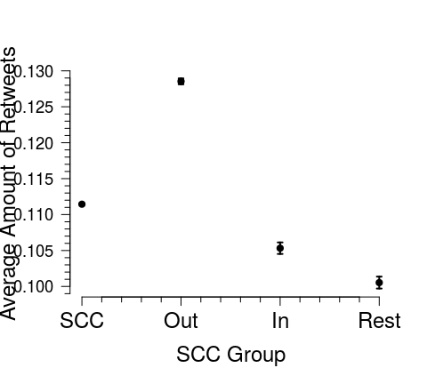

# Social Impact in Twitter
David Garcia  
18.08.2016  


```r
download.file("https://www.sg.ethz.ch/media/medialibrary/2016/09/03_IPP_SocialInfluence.zip", destfile="03_Social_Influence.zip")
unzip("03_Social_Influence.zip", exdir = "./") 
file.remove("03_Social_Influence.zip")
```


```r
library(arm)
library(texreg)

d <- read.table("SIdata.dat", header=T, sep="\t")
f <- d$avgRT > 0
d <- data.frame(meanscore=d$meanscore[f], score=d$score[f], avgRT=d$avgRT[f], followers=d$followers[f], incore=d$incore[f])

mRT <- bayesglm(log(avgRT) ~ log(incore+1) * log(followers+1), data=d) 
mSC <- bayesglm(log(score) ~ log(incore+1) * log(followers+1), data=d) 
mMN <- bayesglm(log(meanscore) ~ log(incore+1) * log(followers+1), data=d) 

screenreg(list(mRT,mSC,mMN), digits=4)
```

```
## 
## ==================================================================================
##                                     Model 1          Model 2         Model 3      
## ----------------------------------------------------------------------------------
## (Intercept)                              2.1263 ***      3.2217 ***     3.5291 ***
##                                         (0.1385)        (0.0190)       (0.0166)   
## log(incore + 1)                         -0.3889 ***     -0.0632 ***     0.0707 ***
##                                         (0.1052)        (0.0144)       (0.0120)   
## log(followers + 1)                       0.6614 ***      0.1382 ***    -0.0342 ** 
##                                         (0.0982)        (0.0135)       (0.0113)   
## log(incore + 1):log(followers + 1)      -0.0609 ***      0.0021         0.0005    
##                                         (0.0099)        (0.0014)       (0.0011)   
## ----------------------------------------------------------------------------------
## AIC                                  31939.4027       4955.9694      1874.6203    
## BIC                                  31973.5157       4990.0810      1908.2267    
## Log Likelihood                      -15964.7013      -2472.9847      -932.3102    
## Deviance                             43911.3198        823.4551       486.6180    
## Num. obs.                             6786            6784           6132         
## ==================================================================================
## *** p < 0.001, ** p < 0.01, * p < 0.05
```


```r
library(lmtest)

m1 <- bayesglm(log(avgRT) ~ log(followers+1), data=d)                                       
m2 <- bayesglm(log(avgRT) ~ log(incore+1), data=d)     
lrtest(m1,m2)
```

```
## Likelihood ratio test
## 
## Model 1: log(avgRT) ~ log(followers + 1)
## Model 2: log(avgRT) ~ log(incore + 1)
##   #Df LogLik Df  Chisq Pr(>Chisq)    
## 1   3 -15996                         
## 2   3 -15992  0 8.0792  < 2.2e-16 ***
## ---
## Signif. codes:  0 '***' 0.001 '**' 0.01 '*' 0.05 '.' 0.1 ' ' 1
```

```r
m1 <- bayesglm(log(meanscore) ~ log(followers+1), data=d)                                       
m2 <- bayesglm(log(meanscore) ~ log(incore+1), data=d)     
lrtest(m1,m2)
```

```
## Likelihood ratio test
## 
## Model 1: log(meanscore) ~ log(followers + 1)
## Model 2: log(meanscore) ~ log(incore + 1)
##   #Df  LogLik Df  Chisq Pr(>Chisq)    
## 1   3 -950.92                         
## 2   3 -937.90  0 26.028  < 2.2e-16 ***
## ---
## Signif. codes:  0 '***' 0.001 '**' 0.01 '*' 0.05 '.' 0.1 ' ' 1
```


```r
par(mar=c(4,4,0,0))
par(mfrow=c(1,3))
hist(log(d$avgRT), main="", xlab="log mean RT")
hist(d$score, main="", xlab="Klout score")
hist(d$meanscore, main="", xlab="Mean influenced klout score")
```

<!-- -->


```r
par(mar=c(4,5,1.5,0.5))
par(mfrow=c(1,3))

hist(residuals(mRT), main="", xlab="Residual RT Model", cex.axis=2,cex.lab=2)
hist(residuals(mSC), main="", xlab="Residual KS Model", cex.axis=2,cex.lab=2)
hist(residuals(mMN), main="", xlab="Residual IK Model", cex.axis=2,cex.lab=2)
```

<!-- -->


```r
par(mar=c(4,5,1.5,0.5))

incorevals <- c(40,50,78,100,200)
follvals <- exp(seq(0, log(max(d$followers)), by=0.01))

Pdata <- data.frame(followers=rep(follvals, length(incorevals)), incore=rep(incorevals, each=length(follvals)))
RTpred <- predict(mRT, newdata=Pdata)
Pdata$fit <- exp(RTpred)

plot(follvals, Pdata$fit[Pdata$incore==incorevals[1]], type="l", lwd=2, xlab="Popularity in 2009", ylab="Social impact (mean retweets)", xaxt="n", yaxt="n", cex.lab=1.3)
lines(follvals, Pdata$fit[Pdata$incore==incorevals[2]], col="red", lwd=2)
lines(follvals, Pdata$fit[Pdata$incore==incorevals[3]], col="blue", lwd=2)
lines(follvals, Pdata$fit[Pdata$incore==incorevals[4]], col="darkorange", lwd=2)
lines(follvals, Pdata$fit[Pdata$incore==incorevals[5]], col="purple", lwd=2)

library(sfsmisc)
eaxis(1,cex.axis=1.25)
eaxis(2,cex.axis=1.25)
legend("topleft", c("I=40", "I=50", "I=78", "I=100", "I=200"), col=c("black","red","blue","darkorange","purple"), lwd=rep(2,5), box.lwd=-1)
```

<!-- -->


```r
par(mar=c(4,5,1.5,0))
library(lattice)

incorevals <- 10^seq(0, log10(max(d$incore)), by=0.35)
follvals <- 10^seq(0, log10(max(d$followers)), by=0.35)

newdata <- data.frame(incore=rep(incorevals, length(follvals)),
                  followers=rep(follvals, each=length(incorevals)))
newdata$I09 <- log(newdata$incore+1)
newdata$F09 <- log(newdata$followers+1)
newdata$RT <- predict(mRT, newdata=newdata)
newdata$KS <- predict(mSC, newdata=newdata)
newdata$IK <- predict(mMN, newdata=newdata)

cscale <- rev(terrain.colors(24*100))
wireframe(RT~I09*F09, newdata,drape = TRUE, colorkey = TRUE,           col.regions=cscale,cex.axis=1, cex.lab=1, scales=list(arrows=FALSE), par.box=list(lty=2))
```

<!-- -->


```r
par(mar=c(4,5,1.5,0))

cscale <- rev(topo.colors(24*100))
clims <-round(range(newdata$mSCpred))*100
wireframe(KS~I09*F09, newdata,drape = TRUE, colorkey = TRUE, col.regions=cscale,cex.axis=1, cex.lab=1, scales=list(arrows=FALSE), par.box=list(lty=2))
```

<!-- -->


```r
par(mar=c(4,5,1.5,0))

cscale <- rev(heat.colors(24*100))
clims <-round(range(newdata$mMNpred))*100
wireframe(IK~I09*F09, newdata,drape = TRUE, colorkey = TRUE,           col.regions=cscale,cex.axis=1, cex.lab=1, scales=list(arrows=FALSE), par.box=list(lty=2))
```

<!-- -->
